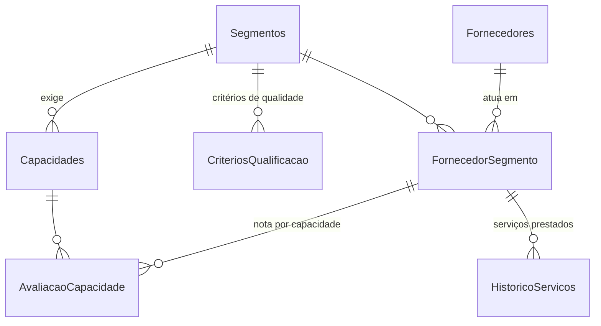

# Gestão de Fornecedores — SharePoint Lists + Power Apps

Proposta de estrutura para levar a planilha **"Estruturação de Fornecedores"** para um app
no Microsoft 365, com o mesmo raciocínio que já existe no Excel:

| Planilha (hoje) | App (proposta) |
|---|---|
| CADASTRO DE FORNECEDORES | Lista **Fornecedores** + tela de cadastro |
| CAPACIDADE TÉCNICA (capacidade × peso × nota, por segmento) | Listas **Capacidades** (o que cada segmento exige, com peso) e **AvaliacaoCapacidade** (nota de cada fornecedor) |
| QUALIFICAÇÃO – metodologia (critérios 0–5) | Lista **CriteriosQualificacao** |
| QUALIFICAÇÃO – histórico de serviços | Lista **HistoricoServicos** + tela "Registrar serviço" |
| DASHBOARD (índices acumulados, índice global, status) | Lista **FornecedorSegmento** (guarda os índices já calculados) + tela Dashboard |

Arquivos desta pasta:

| Arquivo | Para que serve |
|---|---|
| `provisionar-listas.ps1` | Cria todas as listas e colunas no SharePoint e importa os dados da planilha |
| `extrair_excel.py` | Lê a planilha e gera os CSVs da pasta `dados/` (rode de novo se a planilha mudar) |
| `dados/*.csv` | Dados atuais da planilha, já normalizados (29+1 fornecedores, 160 notas de capacidade, 10 serviços) |
| `powerfx.md` | Fórmulas do app, tela por tela, prontas para colar |
| `site/index.html` | Versão site do app (painel, cadastro, capacidade, histórico, metodologia, exportação CSV para o Dataverse) |
| `site/seed.json` | Dados da planilha no formato do site (gerado por `site/gerar_seed.py`) |

**Versão site:** publicada no claude.ai com os dados compartilhados pela equipe. Fora do claude.ai
(por ex. GitHub Pages, ou `python3 -m http.server` dentro de `site/`), ela funciona sozinha,
carrega `seed.json` e guarda as alterações só no navegador de quem usa.

---

## 1. Recomendação de ferramenta

**SharePoint Lists + Power Apps (app de tela)** — e o dashboard dentro do próprio app.

- Já está incluso na licença Microsoft 365 da empresa (Dataverse exigiria licença Premium por usuário).
- O volume é pequeno (dezenas de fornecedores, centenas de serviços por ano): bem dentro do que o SharePoint aguenta.
- As listas continuam acessíveis direto pelo SharePoint/Teams para consulta e exportação para Excel.

Sugestões extras, opcionais:

- **Power BI** (se a empresa tiver licença Pro): um painel com evolução dos índices no tempo,
  ranking por segmento, gasto por fornecedor. Ele lê as mesmas listas — nada muda no app.
- **Power Automate**: (a) avisar Suprimentos por e-mail/Teams quando um serviço receber nota ≤ 2
  em qualquer índice; (b) lembrete mensal para o projetista avaliar serviços com data de entrega
  passada e sem avaliação.
- **Teams**: fixar o app como uma aba no canal da equipe de projetos, para o projetista registrar
  o serviço sem sair do Teams.

Quando valeria ir para **Dataverse**: se o app crescer para pedidos de compra, aprovações com
alçada, ou integração com ERP. A estrutura abaixo migra quase 1:1.

---

## 2. Modelo de dados

A principal mudança em relação ao Excel: na planilha, cada fornecedor é um **bloco copiado**
(capacidades repetidas, fórmulas apontando para células fixas, no máximo 8 linhas de histórico).
No app, as regras ficam **uma vez só** (listas de configuração) e cada avaliação vira **uma linha**.



### Configuração (só o Administrador altera)

| Lista | Colunas | Observação |
|---|---|---|
| **Segmentos** | Segmento, Ordem | Usinagem, Caldeiraria, Pintura, Tratamento Térmico/Superficial, Prototipagem |
| **Capacidades** | Capacidade, Segmento*, Peso, Ordem, Ativa | Ex.: Usinagem → Torno CNC (peso 1), Fresadora 5 eixos (0,5)… |
| **CriteriosQualificacao** | Descrição, Segmento*, Dimensão (Qualidade/Prazo/Custo), Nota 0–5 | Qualidade: um conjunto por segmento. Prazo e Custo: Segmento em branco = vale para todos |
| **Usuarios** | Nome, Email, Papel | Define o que cada pessoa vê/faz no app |

### Operação

| Lista | Colunas | Observação |
|---|---|---|
| **Fornecedores** | Empresa, CNPJ, Telefone, Email, Endereço, Responsável, Ativo, Observações | Um registro por empresa |
| **FornecedorSegmento** | Vínculo ("EISEN — Usinagem"), Fornecedor*, Segmento*, **Status**, Justificativa do status, NotaCapacidade, MediaQualidade, MediaPrazo, MediaCusto, **IndiceGlobal**, QtdServicos, UltimoServico | O "cartão" do dashboard. Um fornecedor pode atender mais de um segmento, com status diferente em cada |
| **AvaliacaoCapacidade** | Vínculo*, Capacidade*, Atendimento (Atende / Parcialmente / Não atende), Nota | Uma linha por capacidade avaliada |
| **HistoricoServicos** | Projeto, Vínculo*, Data do orçamento, Projetista, **Relato**, Valor orçado, Data prevista, Data de entrega, NotaQualidade, NotaPrazo, NotaCusto | Uma linha por serviço. Sem limite de linhas |

`*` = coluna de pesquisa (lookup) para outra lista.

Os índices em **FornecedorSegmento** são recalculados pelo app a cada serviço registrado ou
capacidade salva. Assim o dashboard abre rápido e a lista pode ser ordenada/filtrada direto no SharePoint.

---

## 3. Papéis

| Papel | Quem | O que faz no app | Permissão no SharePoint |
|---|---|---|---|
| **Administrador** | Responsável pela metodologia (Engenharia/Qualidade) | Tudo, incluindo segmentos, capacidades, pesos e critérios | Controle total no site |
| **Suprimentos** | Compras | Cadastra fornecedores, avalia capacidade técnica, altera status | Editar: Fornecedores, FornecedorSegmento, AvaliacaoCapacidade, HistoricoServicos. Leitura: configuração |
| **Projetista** | Quem contratou o serviço | Registra serviço e dá as notas de qualidade, prazo e custo | Editar: HistoricoServicos e FornecedorSegmento (o app atualiza os índices). Leitura: o resto |
| **Consulta** | Gestão, demais áreas | Vê dashboard e histórico | Leitura |

Crie um grupo do SharePoint por papel (ou use grupos do Microsoft 365) e quebre a herança de
permissão das listas de configuração. A lista **Usuarios** só controla o que aparece no app;
quem protege os dados de verdade é a permissão do SharePoint.

---

## 4. Telas do app

1. **Dashboard** (tela inicial)
   - Cartões no topo: nº de fornecedores ativos, nº homologados, **média global** de todos os fornecedores.
   - Filtros por segmento e status.
   - Um cartão por fornecedor × segmento, ordenado pelo índice global: status (com cor),
     barras 0–5 de Capacidade, Qualidade, Prazo e Custo, índice global, nº de serviços e
     data do último serviço; e um aviso "Sugerido: Homologado" quando a regra da seção 6
     discorda do status atual.
2. **Fornecedores** — busca por nome, botão "Novo fornecedor" (Suprimentos/Admin), formulário
   com os dados de cadastro e escolha dos segmentos em que ele atua.
3. **Fornecedor (detalhe)**, com três abas:
   - *Dados* — cadastro e contato;
   - *Capacidade técnica* — a lista de capacidades exigidas pelo segmento, cada uma com
     Atende / Atende parcialmente / Não atende, e a nota 0–5 calculada na hora;
   - *Histórico* — serviços anteriores com projeto, data, relato e as três notas; botão
     "Registrar serviço" e botão "Alterar status" (com justificativa obrigatória).
4. **Registrar serviço** — projeto, data do orçamento, relato, valor, datas prevista/entrega,
   e três listas suspensas com a **descrição** dos critérios ("1-2 cotas precisam de ajuste",
   "2 dias de atraso", "Entre 10% acima e na média dos orçamentos"…). O projetista escolhe a
   situação; a nota vem do critério. O prazo pode ser sugerido automaticamente pelas datas.
5. **Configurações** (só Administrador) — edição de segmentos, capacidades/pesos e critérios.

As fórmulas de cada tela estão em [`powerfx.md`](powerfx.md).

---

## 5. Regras de cálculo

Mantidas iguais às da planilha, exceto onde indicado.

**Capacidade técnica (0–5)**

- Cada capacidade do segmento tem um peso (0,5 ou 1). Nota do fornecedor na capacidade:
  Atende = peso, Atende parcialmente = metade do peso, Não atende = 0.
- `NotaCapacidade = soma das notas ÷ soma dos pesos do segmento × 5`.
  Hoje os pesos de todos os segmentos somam exatamente 5, então o resultado é igual ao TOTAL
  da planilha. A normalização só garante que continue em 0–5 se alguém incluir uma capacidade nova.

**Qualificação (por serviço, 0–5)** — escolhida pelo critério:
Qualidade (critérios próprios de cada segmento), Prazo e Custo (iguais em todos).

**Índices acumulados** = média de todos os serviços do fornecedor naquele segmento
(na planilha: `MÉDIA` das 8 linhas do bloco; no app: sem limite de linhas).

**Índice global** = média de Qualidade, Prazo e Custo — igual ao DASHBOARD da planilha.
A capacidade técnica fica de fora do índice global (como hoje) e aparece separada.

Conferência com os dados atuais (calculado pelo `extrair_excel.py` e pelo script de importação):

| Fornecedor | Segmento | Capacidade | Qualidade | Prazo | Custo | Global | Serviços | Status |
|---|---|---|---|---|---|---|---|---|
| EISEN | Usinagem | 2,5 | 3,33 | 3,33 | 2,00 | **2,89** | 6 | Homologado |
| USITEC | Usinagem | 2,0 | 5,00 | 5,00 | 3,00 | **4,33** | 1 | Em avaliação |
| GUERCAM | Usinagem | 2,5 | 5,00 | 5,00 | 1,00 | **3,67** | 1 | Em avaliação |
| VITARI | Caldeiraria | 4,5 | 4,50 | 4,50 | 2,00 | **3,67** | 2 | Homologado |

(Os demais 26 ainda não têm serviço registrado na planilha.)

---

## 6. Status do fornecedor

Na planilha o status é digitado à mão. No app ele continua sendo **uma decisão de
Suprimentos** (campo Status + justificativa com data e autor), mas o app mostra um
**status sugerido** para apoiar a decisão:

| Sugestão | Regra (aplicada na ordem) |
|---|---|
| Em avaliação | menos de 2 serviços avaliados |
| Bloqueado | índice global < 2,0 |
| Homologado | mais de 4 serviços (5 ou mais) e índice global > 2,0 |
| Em avaliação | demais casos (2 a 4 serviços com índice global ≥ 2,0) |

Status disponíveis: **Em avaliação, Homologado** e **Bloqueado** (para não precisar apagar um
fornecedor reprovado e perder o histórico).

**Especializado** não é mais um status: é um **selo manual** (coluna Sim/Não `Especializado`),
marcado por Suprimentos ao alterar o status. Ele soma ao status — um fornecedor pode ser
*Homologado + Especializado*. Os 5 fornecedores que estavam como "Especializado" na planilha
(USIFIL, TECHNOFIL, FAG, LADI'S, LANFIBRAS) foram importados como *Em avaliação + Especializado*.

Na tela, "Aplicar sugestão" abre a alteração de status já com o status sugerido e uma
justificativa pronta ("Regra aplicada: 6 serviços, índice global 2,89"), que pode ser editada.

---

## 7. Implantação passo a passo

1. **Criar um site do SharePoint** (ou usar o site da equipe no Teams), por ex. `/sites/Fornecedores`.
2. **Gerar os dados** (já estão na pasta `dados/`; só rode de novo se a planilha mudar):
   ```bash
   pip install openpyxl
   python3 extrair_excel.py "Estruturação de Fornecedores.xlsx"
   ```
3. **Criar as listas e importar**, no PowerShell 7:
   ```powershell
   Install-Module PnP.PowerShell -Scope CurrentUser
   Register-PnPEntraIDAppForInteractiveLogin -ApplicationName "PnP Fornecedores" -Tenant <tenant>.onmicrosoft.com
   .\provisionar-listas.ps1 -SiteUrl https://<tenant>.sharepoint.com/sites/Fornecedores -ClientId <ClientId do passo anterior>
   ```
   O registro do app (2ª linha) pode exigir um administrador do Microsoft 365.
   Sem acesso a PowerShell: crie as listas à mão seguindo a seção 2 e use
   "Nova lista → Do Excel"/colagem em "Editar em grade" para os CSVs.
4. **Preencher a lista Usuarios** com os e-mails e papéis, e ajustar as permissões (seção 3).
5. **Criar o app** em make.powerapps.com → Criar → Aplicativo de tela em branco (formato tablet),
   adicionar as 8 listas como fonte de dados e montar as telas com as fórmulas de `powerfx.md`.
   Atalho: comece por "Iniciar com dados" a partir da lista Fornecedores — o Power Apps gera as
   telas de lista/detalhe/edição — e acrescente Dashboard, Capacidade e Registrar serviço.
6. **Publicar** e compartilhar o app com os grupos; fixar como aba no Teams.
7. (Opcional) Fluxos do Power Automate e painel do Power BI (seção 1).

---

## 8. Pontos encontrados na planilha (para decidir antes de importar)

1. **Cadastro incompleto** — só 3 fornecedores (EISEN, USITEC, EJP) têm contato/endereço;
   os outros 27 aparecem só na Capacidade Técnica. Eles são importados sem contato — completar no app.
2. **EJP** está no Cadastro (Caldeiraria) mas não tem capacidade avaliada — entra como "Em avaliação".
3. **WELDVISION** tem nota **1** em "Soldagem de inox" e "Chapas espessas", que têm peso **0,5**.
   Na planilha isso soma mais que o máximo; na importação a nota foi limitada ao peso (0,5).
   Confirme se o peso dessas capacidades deveria ser 1.
4. **Prototipagem** — os critérios de **Qualidade** estão sem descrição (só as notas 5 a 0).
   Precisam ser definidos (ex.: "Dimensional e acabamento conformes", "Rebarbas/porosidade
   leves", …) antes de registrar serviços desse segmento.
5. **Faixas sem critério** — Prazo pula de "2 dias" para "4 dias" (3 dias de atraso?) e de
   "4 dias" para "> 1 semana" (5–7 dias?). Na sugestão automática de prazo usei 2–3 dias = 3
   e 4–7 dias = 2. Custo: "Mais de 20% acima" (1) e "Mais de 50% acima" (0) se sobrepõem — sugestão:
   "Entre 20% e 50% acima" = 1.
6. **Nomes padronizados** — "Dobra (até 6mm)" × "Dobra", "Calandra (até 12mm)" × "Calandra",
   "Eletroerosão (penetração)" × "Eletroerosão" viraram uma capacidade só cada, e "Fudição" foi
   corrigido para "Fundição". Se os limites de espessura importam, vale deixá-los no nome da
   capacidade para todos.
7. **Índice de custo depende da "média dos orçamentos"** — hoje o projetista avalia de cabeça.
   Se quiser automatizar no futuro, cada orçamento recebido (inclusive dos perdedores) precisaria
   ser registrado com valor — dá para fazer com uma lista **Orcamentos** extra.
